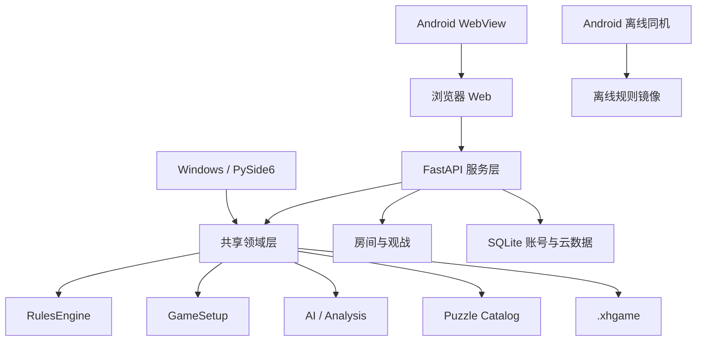

# 匈汉象棋 1.2.0 迭代交付说明

## 项目根目录

```text
xionghan-chess-next/
├── src/xionghan_chess/
│   ├── core/
│   │   ├── model.py              # 棋子、走法、状态与序列化
│   │   ├── profiles.py           # 四套模式、初始棋位和规则选项
│   │   ├── rules.py              # 唯一权威规则引擎
│   │   ├── game.py               # 对局状态机、计时、悔棋与结算
│   │   ├── setup.py              # 等量让子与红/黑/随机先手
│   │   ├── ai.py                 # 内置分级 AI
│   │   ├── analysis.py           # 逐步质量、推荐变招与胜率分析
│   │   ├── puzzles.py            # 分级题库加载和增量导入契约
│   │   ├── data/puzzles.json     # 首批内置训练题
│   │   ├── protocol.py           # WebSocket 消息协议
│   │   └── storage.py            # 向后兼容的 .xhgame 存档
│   ├── service/
│   │   ├── app.py                # FastAPI、账号、云同步、分析和题库 API
│   │   ├── rooms.py              # 权威房间、玩家与只读观战通道
│   │   └── accounts.py           # SQLite 账号、会话、偏好和云棋谱
│   ├── desktop/
│   │   ├── app.py                # PySide6 桌面成品
│   │   ├── config.py             # 桌面偏好
│   │   └── storage.py            # 本地棋谱和统计
│   └── i18n.py                   # Python 端语言资源入口
├── web/
│   ├── index.html                # Web/安卓在线模式工作台
│   ├── css/app.css               # 明暗系统主题和响应式布局
│   └── js/app.js                 # 棋盘、账号、观战、分析和训练交互
├── android/
│   ├── MainActivity.cs           # Android WebView、服务器切换和文件桥
│   └── Resources/assets/offline/ # 无服务器时的离线同机成品
├── locales/                      # 中英文共享词条
├── tests/                        # 58 项规则、协议、账号和扩展测试
├── packaging/                    # Windows 打包脚本
├── deploy/                       # Docker 部署
└── docs/                         # 架构、规则、运行、FAQ 与本交付文档
```

## 分层结构图



联网对局始终由服务端 `Game` 和 `RulesEngine` 判定。Web 与 Android 在线模式提交走棋意图，桌面联网模式遵循同一协议；任何客户端显示层都不能绕过权威规则。

## 本次功能清单

1. 明暗系统主题、五套棋盘底色/背景和三套棋子皮肤；偏好保存在本机，登录后同步到云端。
2. 正常/让子对局统一使用初始棋位槽位。双方可逐枚勾选，必须数量相同、属于当前模式且双方主帅登场；支持红先、黑先、随机。
3. 注册、登录、个人身份、30 天会话、偏好同步、云棋谱和收藏。密码采用 PBKDF2-SHA256 加盐存储。
4. Web、桌面及 Android 在线/离线均支持一键翻转；鼠标/触控命中、可行点、吃子提示和动画同步转换。
5. 联机房间提供独立只读观战令牌和 WebSocket；观众可接收实时局面、最后着法与聊天，不能发送走棋指令。
6. 按产品确认保持原有 `.xhgame` 代码和配置，不增加 PGN/FEN/XQF/CBL 适配。
7. 按产品确认保持原有记谱与局面代码，不增加标准 PGN/FEN 工具。
8. 内置 AI 逐步分析输出最佳/良好/欠准/失误/严重失误、分值损失、推荐走法和红方胜率曲线。
9. 首批 9 道入门/进阶/大师训练题，支持提示、启动训练、复盘入口和 JSON 题库增量导入契约。

## API 摘要

- `POST /api/auth/register`、`POST /api/auth/login`、`GET /api/me`
- `PUT /api/me/preferences`、`GET|POST /api/me/games`
- `PUT /api/me/games/{id}/favorite`
- `POST /api/rooms`：接受 `firstMove`、`redSlots`、`blackSlots`
- `POST /api/rooms/{id}/spectate`、`WS /ws/{id}/spectate`
- `POST /api/analysis`
- `GET /api/puzzles`、`GET /api/puzzles/{id}`

## 运行与验证

```powershell
cd xionghan-chess-next
py -m pip install -e ".[desktop,test]"
$env:PYTHONPATH = "src"
py -m xionghan_chess.service.app
```

Web 与 Android 在线模式访问 `http://127.0.0.1:8000/`。桌面端运行 `py -m xionghan_chess.desktop.app`。

本次验收结果：

- `py -m pytest -q`：58 passed。
- Python `compileall`：通过。
- Web 与 Android 离线 JavaScript 语法：通过。
- Android Debug：构建成功，0 错误；26 条既有平台兼容/裁剪警告。
- PySide6 离屏主窗口：启动成功。
- Web 桌面与 390×844 手机视口：Canvas 非空，无横向溢出，翻转和功能对话框通过交互检查。

## 数据与运维

账号数据库默认位于 `~/.xionghan-chess/cloud.db`，可通过 `XIONGHAN_DATA_DIR` 指定目录。生产环境必须使用 HTTPS/WSS，并定期备份该 SQLite 文件。当前房间仍为单进程内存状态；账号、偏好和云棋谱可跨服务重启保留。
